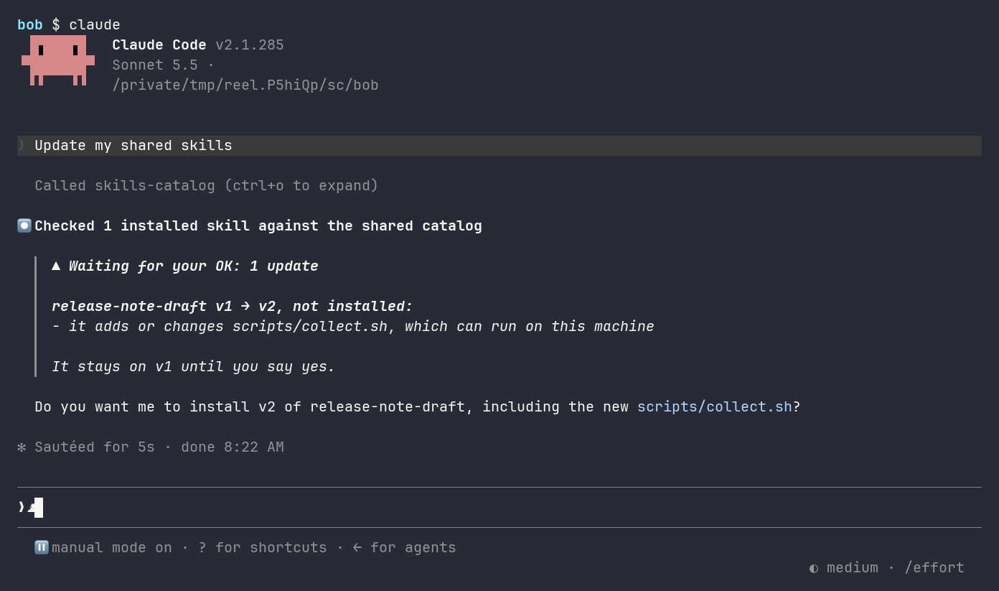
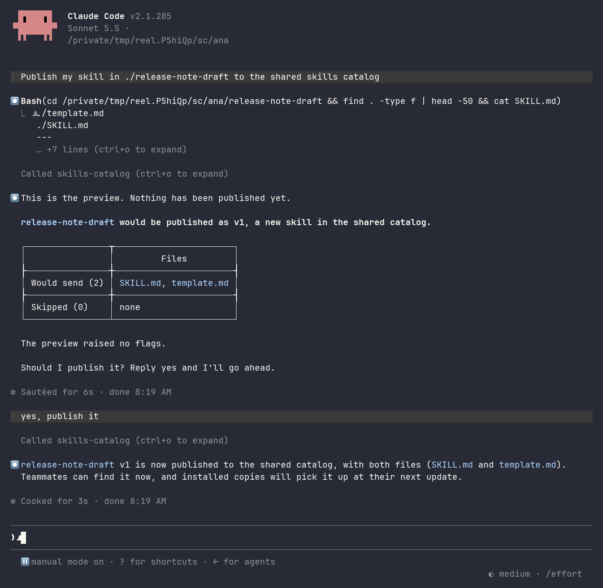
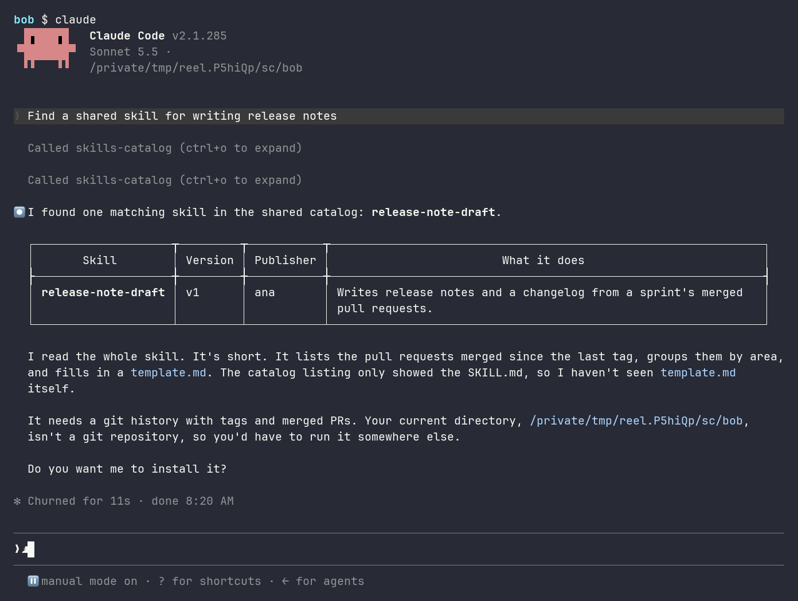
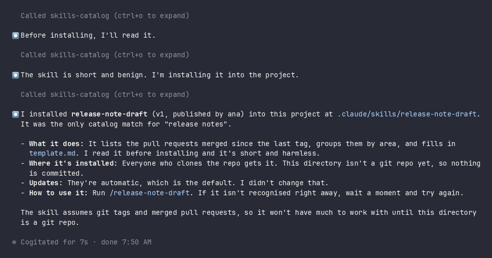
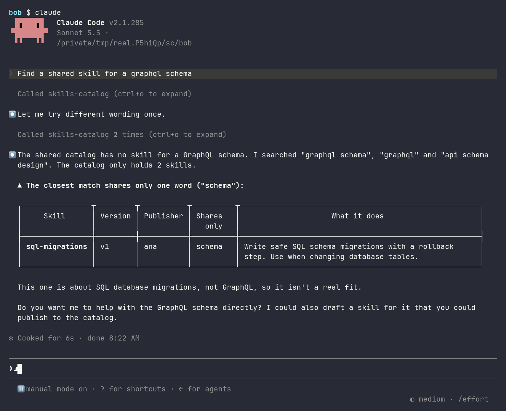
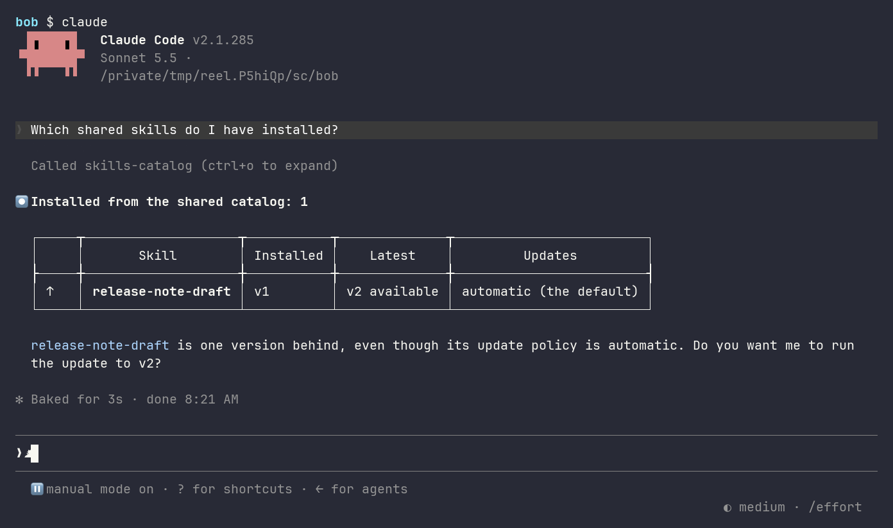
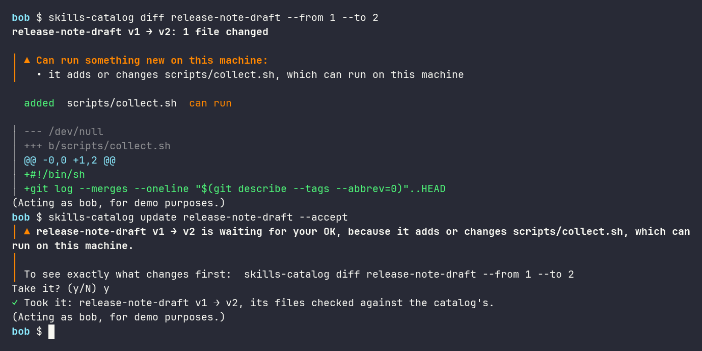
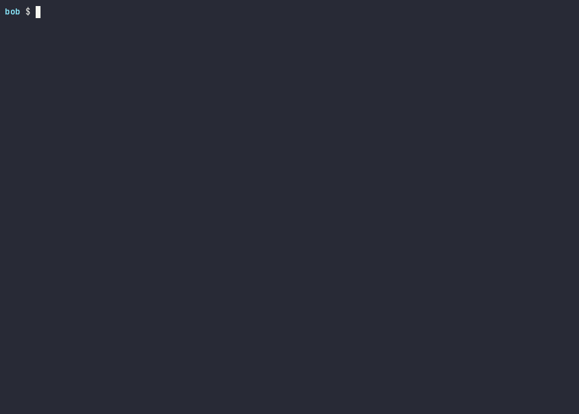

<h1 align="center">Skills Catalog</h1>

<p align="center">Share an AI-assistant skill once.<br>Your teammates' assistants find it, install it, and keep it up to date.</p>

<p align="center">  </p>

<p align="center"><a href="docs/pictures/claude-code/update.png"></a></p>

<p align="center"><sub>Real Claude Code. Version 2 of a skill adds a script, so the update waits for a yes.</sub></p>

<p align="center"><a href="#check-it-against-the-prd">The PRD, item by item</a> · <a href="#try-it">Try it</a> · <a href="#install">Install</a> · <a href="docs/thinking.md">Our thinking</a> · <a href="docs/architecture.md">Architecture</a> · <a href="docs/decisions.md">Decisions</a> · <a href="docs/api.md">API</a></p>

- **Publish once.** A skill goes into a shared catalog as a numbered version. Nothing is overwritten.
- **Find it by asking.** Your assistant searches in plain words. It says so when nothing really fits.
- **Get the same skill, safely.** An install checks every file against what was published. An update that could run something new waits for your yes.

## See it in Claude Code

Real sessions: **ana** and **bob** (the PRD's Developer 1 and Developer 2) share one catalog. Click a screen to open it full size.

<table>
<tr>
<td width="33%" valign="top"><b>1 · ana publishes</b> <sub>FR-01</sub><br><a href="docs/pictures/claude-code/publish.png"></a><br><sub>A preview first. Nothing is sent until she says yes.</sub></td>
<td width="33%" valign="top"><b>2 · bob finds it</b> <sub>FR-02</sub><br><a href="docs/pictures/claude-code/search.png"></a><br><sub>Matches as a table: name, version, who published it.</sub></td>
<td width="33%" valign="top"><b>3 · bob gets it</b> <sub>FR-03</sub><br><a href="docs/pictures/claude-code/install.png"></a><br><sub>Read first, then installed: v1, by ana.</sub></td>
</tr>
<tr>
<td valign="top"><b>4 · Nothing fits exactly</b> <sub>UC-02</sub><br><a href="docs/pictures/claude-code/closest.png"></a><br><sub>The closest is shown as close, never as a fit.</sub></td>
<td valign="top"><b>5 · bob's installed skills</b> <sub>FR-04</sub><br><a href="docs/pictures/claude-code/list.png"></a><br><sub>↑ marks a newer version.</sub></td>
<td valign="top"><b>6 · bob decides, in his own terminal</b> <sub>FR-04</sub><br><a href="docs/pictures/claude-code/terminal.png"></a><br><sub>The change in orange, then “✓ Took it”.</sub></td>
</tr>
</table>

<details><summary><b>The reels</b>: ana publishes · bob installs · bob's update waits for his yes</summary>

<br>Recorded with [`qa/reels/record.sh`](qa/reels/record.sh) (Claude Code on Sonnet, typed as a person would).

**ana publishes.** A preview, then her yes. Claude Code's permission prompt is her consent.

<p align="center"></p>

**bob finds and installs it.** His assistant reads it first. `skills-catalog list` shows it in his own terminal.

<p align="center"></p>

**bob's update waits for his yes.** Version 2 adds a script. He looks at the change, then takes it.

<p align="center"></p>

</details>

## Check it against the PRD

Each PRD item, where you see it, and the requirement in [`qa/traceability.yaml`](qa/traceability.yaml) that lists its tests. *Scene* means a scene of `npm run try-it` ([Try it](#try-it)); each scene is tagged with its PRD item.

| PRD | What you see | Where | Checked by |
|---|---|---|---|
| **FR-01** Publish | A preview, then v1 in the catalog | screen 1 · scene 1 | [publish](qa/traceability.yaml#L14) |
| ↳ UC-01: missing a field | Refused, with the fix; nothing stored | scene 2 | [publish-rejects-invalid](qa/traceability.yaml#L46) |
| **FR-02** Discover | Matches with name, version, description | screen 2 · scene 3 | [discover](qa/traceability.yaml#L83) |
| ↳ UC-02: nothing matches | "No skill matches", or the closest only as close | screen 4 · scenes 4-5 | [discover-nothing-matches](qa/traceability.yaml#L97) |
| **FR-03** Retrieve | Read, then installed: v1, by ana | screen 3 · scene 6 | [retrieve](qa/traceability.yaml#L124) |
| ↳ UC-03: not found | "No skill named …", with names like it | scene 8 | [retrieve-not-found](qa/traceability.yaml#L141) |
| **FR-04** Version | v2 stored, v1 kept · the history · v1 on request · the change | screens 5-6 · scenes 9, 11-13 | [version-new](qa/traceability.yaml#L161), [version-history-visible](qa/traceability.yaml#L174), [version-latest-default](qa/traceability.yaml#L184) |
| ↳ UC-04: malformed update | Refused; v1 and v2 untouched | scene 10 | [version-malformed-untouched](qa/traceability.yaml#L195) |
| **NFR** Consistency | Fetched files equal the published ones, byte for byte; same fingerprint | scene 7 | [consistency](qa/traceability.yaml#L204) |
| **NFR** Through an assistant | Every screen: Claude Code calling the catalog | screens 1-6 · `qa/try-claude.sh selftest` | [assistant-mediated](qa/traceability.yaml#L217) |
| **NFR** Responsiveness | p95 under 100 ms on a 10,000-skill catalog | `npm run perf` | [responsiveness](qa/traceability.yaml#L226) |
| **Goal 1** End to end | Developer 1 publishes; Developer 2's assistant finds and gets the same skill | screens 1-3 · the reels | [end-to-end](qa/traceability.yaml#L151) |
| **D1, D2** | Access through the assistant; versions in the MVP | as the NFR and FR-04 above | |
| **D3** No auth, no de-dup | De-dup isn't built. Sign-in exists only on the opt-in hosted catalog | [why](docs/thinking.md#beyond-the-prd) | |

**The PRD's words, here:**

| PRD | Here |
|---|---|
| Skill · Manifest | A folder with a `SKILL.md` (the manifest: name and description in its front matter, instructions below), plus any other files |
| Catalog · Version | The shared catalog: a folder on one machine, or hosted in AWS. Versions are v1, v2, …; each has a **fingerprint**, one checksum of all its files, so a copy can be checked against what was published |
| Publish · Discover · Retrieve | The assistant's tools `publish_skill_to_catalog`, `search_shared_skills`, and `read_shared_skill` / `install_shared_skill` |

## Try it

### In a minute, without Claude Code

**Needs:** git · Node.js 24.15+ (`node --version`) · macOS or Linux.

```sh
git clone https://github.com/nandr-web/skills-catalog.git
cd skills-catalog/core
npm ci --ignore-scripts
npm run try-it
```

A script plays ana and bob on a new catalog in a temporary folder, then deletes it. Lines marked │ are what an assistant reads back.

You should see each PRD item as a scene, ending with **Nothing else was changed.**

<table><tr>
<td width="50%" valign="top"></td>
<td width="50%" valign="top"></td>
</tr></table>

<details><summary>What it printed on our machine</summary>

<!-- checked: npm run try-it -->
```text
Made a new, empty catalog in …/skills-catalog-try-…/catalog
Lines marked │ are what an AI assistant, such as Claude, would read back: the product's own words.
Lines marked ✓ are this script's own checks. Each scene ends with the PRD item it shows, in [ ].

1. ana publishes two skills  [FR-01]
   │ published release-note-draft v1 as ana, fingerprint sha256:91d7f2a532db…
   │ published sql-migrations v1 as ana, fingerprint sha256:12504ca30e20…

2. ana publishes a skill whose SKILL.md has no description  [FR-01 rejected]
   │ invalid_manifest: ./standup-notes/SKILL.md has no description in its front matter. Nothing was published. Fix: …
   │ not_found: no skill named "standup-notes" in the shared catalog. Nothing was changed.
   │ …

3. bob searches "changelog for a release"  [FR-02]
   │ Shared catalog: 1 of 2 skills match "changelog for a release" (keyword match).
   │ - release-note-draft (v1, ana; tags: release, docs): Write release notes and a changelog from the merged pull requests of a sprint. …
   │ …

4. bob searches "sourdough bread" (nothing in the catalog is about baking)  [UC-02 nothing matches]
   │ Shared catalog: no skill matches "sourdough bread" (keyword match; 2 skills in the catalog). …

5. bob searches "graphql schema" (nothing in the catalog is about GraphQL)  [UC-02 only close]
   │ Shared catalog: no skill matches every word of "graphql schema" (keyword match). The closest share only some of them:
   │ - sql-migrations (v1, ana; shares only: schema): Write safe SQL schema migrations with a rollback step. …
   │ …

6. bob reads release-note-draft  [FR-03]
   │ release-note-draft v1 (latest), published by ana on 2026-10-03.
   │ …

7. bob fetches version 1 and compares it with what ana published  [NFR consistency]
   ✓ the same 2 files, byte for byte: SKILL.md, template.md
   ✓ the same fingerprint: sha256:91d7f2a532db… published, sha256:91d7f2a532db… fetched, sha256:91d7f2a532db… worked out here from ana's files

8. bob mistypes a name: relase-note-draft  [UC-03 not found]
   │ not_found: no skill named "relase-note-draft" in the shared catalog. Names like it: release-note-draft. Nothing was changed.
   │ …

9. ana publishes version 2, which adds a script  [FR-04]
   │ published release-note-draft v2; risk flags: runnable_file (scripts/collect.sh)

10. ana publishes a version 3 whose SKILL.md has no instructions  [UC-04 malformed update]
   │ invalid_manifest: ./release-note-draft/SKILL.md has no instructions below its front matter (the body is empty). Nothing was published. …
   ✓ still 2 versions, latest v2, each as it was: nothing of version 3 was stored

11. bob looks at the history  [FR-04 history]
   │ release-note-draft: 2 version(s), latest v2. Newest first:
   │ - v2 (2026-10-03, ana): add a script that lists merged PRs; review: includes something that can run (scripts/collect.sh).
   │ - v1 (2026-10-03, ana): first version
   │ …

12. bob reads version 1, though version 2 is the latest  [FR-04 earlier version]
   │ release-note-draft v1 (latest is v2), published by ana on 2026-10-03.
   │ …

13. bob compares version 1 with version 2  [FR-04 change visible]
   │ release-note-draft v1 -> v2: 1 file(s) changed. Can run something new on this machine: yes, because it adds or changes scripts/collect.sh, which can run on this machine.
   │ - added: "scripts/collect.sh" (can run)
   │ …

14. bob tries to publish over release-note-draft (only ana, who published it first, may)  [beyond the PRD]
   │ not_owner: release-note-draft belongs to ana; only they publish new versions of it, so nothing was published. …

The catalog folder now holds a database (catalog.sqlite, … KB) and 4 stored files (blobs/).
Deleted …/skills-catalog-try-…. Nothing else was changed.
```

A check runs this script and compares it with this copy, so the copy can't drift: `…` marks what's left out. The script: [core/scripts/try-it.ts](core/scripts/try-it.ts).

</details>

### In real Claude Code (about two minutes)

**Needs:** the [install](#install) · [Claude Code](https://code.claude.com/docs/en/overview), signed in. A script plays ana and bob on a sandbox catalog (`~/sc-try`), outside your own `~/.claude`.

```sh
cd ~/skills-catalog
qa/try-claude.sh install
qa/try-claude.sh launch ana publish
qa/try-claude.sh launch bob install
qa/try-claude.sh launch ana publish-v2
qa/try-claude.sh launch bob update
qa/try-claude.sh accept
qa/try-claude.sh uninstall
```

| Step | You should see |
|---|---|
| `install` | **Ready:** and the sandbox's folder |
| `launch ana publish` | A preview; say yes, and v1 is published (screen 1) |
| `launch bob install` | Found, read, installed (screens 2-3) |
| `launch ana publish-v2` | v2 published, adding a script |
| `launch bob update` | **Waiting for your OK: 1 update** (the top screen) |
| `accept` | **Take it? (y/N)**; y: **Took it** (screen 6) |
| `uninstall` | **Deleted** and the sandbox's folder |

- `qa/try-claude.sh` alone lists every scenario; `status` and `log` show the catalog.
- `qa/try-claude.sh selftest` runs it all unattended on Haiku (a few cents; at most $0.50 a step). **Needs** tmux too. You should see **PASS: every step seen with real Claude Code**.

<details><summary><b>In Docker</b>: nothing on your machine but Docker</summary>

<br>The first build downloads a Node.js 24 image and Claude Code (a few minutes); later builds take seconds.

```sh
cd ~/skills-catalog
docker build -t skills-catalog .
docker run --rm skills-catalog
docker run --rm -e ANTHROPIC_API_KEY skills-catalog qa/try-claude.sh selftest
```

- `docker run --rm skills-catalog` runs the tests, then the script above. You should see the tests pass and the scenes, ending with **Nothing else was changed.**, then the client's tests pass.
- The selftest **needs** `ANTHROPIC_API_KEY` set in your shell (Claude Code in the container has no sign-in). You should see **PASS: every step seen with real Claude Code**.

</details>

<details><summary><b>Step by step</b>: check Node, install, run the tests, two developers in a script, check the speed (about two minutes)</summary>

Five steps from a clone of this repository.

- **Needs:** git · Node.js 24.15+ (npm comes with it) · macOS or Linux. WSL2 counts as Linux; Windows isn't supported today.
- **Stays here:** nothing is installed outside this folder, except npm's usual cache.

### 1. Check Node (a few seconds)

The catalog uses Node's built-in SQLite, which needs Node.js 24.15 or later.

```sh
node --version
```

You should see **v24.15.0 or later**. Anything lower, or "command not found": install a current Node.js first.

### 2. Install (a few seconds)

Installs the exact versions this project pins. `--ignore-scripts` stops any package from running its own install step (none needs one). The client is only needed for step 5's MCP server lines.

```sh
cd core && npm ci --ignore-scripts
cd ../client && npm ci --ignore-scripts
cd ../core
```

You should see **found 0 vulnerabilities** after each install.

### 3. Run the tests (about 20 seconds)

Type-checks the code, then runs the tests.

- **Left out:** the few slow tests listed in `test/slow.json`. `npm run test:slow` runs those; `npm run test:all` runs everything.
- **Safe:** each test makes its own catalog in a temporary folder and deletes it. A safety check fails the run if anything writes under your home folder.

```sh
npm run check
```

You should see a **Tests** line with no **failed** in it.

- **Expected fail** and **skipped:** checks written ahead for behaviour that's planned but not built yet. Each passes once its piece is built.

<details><summary>What it printed on our machine</summary>

<!-- checked: npm run check (numbers vary) -->
```text
> @skills-catalog/core@0.1.0 check
> node scripts/node-check.mjs && npm run typecheck && npm test
…
 Test Files  38 passed (38)
      Tests  1572 passed | 63 expected fail | 15 skipped (1650)
```

The counts change as tests are added; a check keeps the rest of this copy true.

</details>

### 4. Two developers, one catalog (a few seconds)

```sh
npm run try-it
```

The same script as [above](#in-a-minute-without-claude-code). You should see each PRD item as a scene, ending with **Nothing else was changed.**

### 5. Check the speed with 10,000 skills (about a minute)

Builds a 10,000-skill catalog in a temporary folder, then times the main calls against the budgets in [the test plan](qa/qa-plan.md), in the catalog and through the MCP server, as an assistant calls it.

- It goes quiet for about a minute while it builds.
- It deletes the catalog when it's done.

```sh
npm run perf
```

You should see every timed line start with **ok**; **OVER** would mean a call was too slow. Lines with **no budget** are reported only.

<details><summary>What it printed on our machine</summary>

<!-- checked: npm run perf (numbers vary) -->
```text
catalog: 10000 skills of 1 files, built in 54.5 s; 200 calls each
ok   open (a CLI call pays this once): p95 1.3 ms (budget 100 ms)
ok   publish: p95 7.2 ms (budget 300 ms)
ok   search (words): p95 7.9 ms (budget 100 ms)
ok   search (no words, whole catalog): p95 17.8 ms (budget 100 ms)
ok   read (contents): p95 0.2 ms (budget 100 ms)
ok   a file by its sha256 (stored): p95 0.1 ms (budget 50 ms)
ok   a file by its sha256 (no version names it): p95 0.0 ms (budget 50 ms)
ok   through the MCP server: search (words): p95 7.0 ms (budget 100 ms)
ok   through the MCP server: read: p95 0.4 ms (budget 100 ms)
     through the MCP server: start, until initialize is answered: median 116 ms of 5 (no budget)
     through the MCP server: install: p95 8.5 ms of 50 (no budget)
once: the first writing open of an older catalog, filling the table of which versions name a file: 18 ms
```

p95 means 95 in 100 calls were this fast or faster. A check runs a small version of this and compares its lines with this copy, numbers aside.

</details>

Nothing to clean up: every step deletes its temporary folders. To remove everything, delete this folder.

</details>

## Install

**Needs:** git · Node.js 24.15+ (`node --version`) · macOS or Linux, with `ps` (procps; slim container images lack it) · [Claude Code](https://code.claude.com/docs/en/overview)

### Ask your assistant

Paste this into Claude Code:

```text
Install the Skills Catalog (https://github.com/nandr-web/skills-catalog). It needs Node.js 24.15+.

1. git clone https://github.com/nandr-web/skills-catalog.git ~/skills-catalog
2. cd ~/skills-catalog/core && npm ci --ignore-scripts
3. cd ~/skills-catalog/client && npm ci --ignore-scripts
4. Run its guided setup: node ~/skills-catalog/client/src/cli.ts setup
   Without a terminal it changes nothing and prints its questions, each with its flag:
   ask me them, then run it again with my answers (or with --yes for every default).

Show me each command before you run it.
When it's done, tell me to restart Claude Code.
```

### Or run it yourself

```sh
git clone https://github.com/nandr-web/skills-catalog.git ~/skills-catalog
cd ~/skills-catalog/core && npm ci --ignore-scripts
cd ~/skills-catalog/client && npm ci --ignore-scripts
node ~/skills-catalog/client/src/cli.ts setup
cd ~/skills-catalog
```

Setup asks a few questions (Enter takes each default; `--yes` takes them all) and lists the files it will change. It connects Claude Code to the catalog, signs you in locally as your login name (for demo purposes; no account), and adds the `skills-catalog` command to `~/.local/bin`. [The setup doc](docs/setup.md) lists every question and flag.

You should see **✓ Skills Catalog is set up on this machine.** If `~/.local/bin` isn't on your `PATH`, setup says so and gives the line to add.

### Then

Restart Claude Code and ask, for example, *"find a shared skill for release notes"* or *"publish my skill in ./my-skill"*.

- **Catalog:** `~/.skills-catalog/catalog`; setup's `--catalog <folder>` puts it elsewhere.
- **One machine:** a folder catalog is for one machine (several people or assistants on it). Not a network or synced folder: versions can be lost there. A team on several machines uses a hosted catalog (below).
- **Installed skills:** `~/.claude/skills`, or the project's `.claude/skills` if you ask for this project.

**Uninstall:**

```sh
node ~/skills-catalog/client/src/cli.ts teardown
rm -rf ~/skills-catalog ~/.skills-catalog
```

Teardown puts back the files setup changed. Skills you installed stay in `.claude/skills` until you delete them.

<details><summary><b>A hosted catalog in AWS</b>, for a team on several machines: use one, or deploy your own</summary>

<br>

<p align="center"></p>

**Use one.** Point setup at the catalog's address, then sign in:

```sh
node ~/skills-catalog/client/src/cli.ts setup --catalog https://<the catalog's address>
skills-catalog login --client-id <its GitHub app's client id>    # sign in with GitHub
skills-catalog login --with-token < token.txt                    # or with a personal token
```

- Setup run again over a local setup switches it: Claude Code's entry, the hook and the CLI all read the catalog's address from setup's `config.json`.
- **Token:** saved in `~/.skills-catalog/token`, readable only by you. `skills-catalog logout` deletes it.
- **Who may sign in:** only the GitHub logins the deployment lists. Its owner issues personal tokens with `npm run issue-token` in `hosted/`.

**Deploy your own** (in `infra/`):

1. `npm run deploy-plan -- --account <your 12-digit account> --logins <GitHub logins>` prints what it makes, its budget alarm and every command. It runs nothing.
2. Run those commands with your AWS credentials (several minutes, mostly CloudFront).
3. `npm run smoke -- --url <its address>` checks it. With `SKILLS_TOKEN` set, it also publishes, finds, fetches back and diffs a test skill.

</details>

## Where it stands

| Part | Today |
|---|---|
| Catalog: publish, versions, search, read, history, diff, a review of every publish | ✓ Built |
| Claude Code: the assistant's tools (MCP), guided setup, teardown | ✓ Built |
| CLI: search, read, versions, diff, install, list, update, policy, publish, review, stats, serve, setup, teardown, login, logout | ✓ Built |
| Installer: an update that could run something new, change permissions or come from a new publisher waits for your yes | ✓ Built |
| Hosted catalog in AWS (opt-in) | ✓ Built, deployed, passes its smoke test with real Claude Code |
| pi | Next (phase 2) |
| Copilot, Codex, Cursor, Gemini CLI | Later (phase 3) |
| A web page with a delta view · bundles · agent reviewers | Later |

**Known limits:** search matches keywords (the assistant rewords a paraphrase). Checks with a real assistant run by hand today (`selftest`). What's next, what we cut, and the 4-hour box: [Our thinking](docs/thinking.md).

## How it works

The parts on the developer's machine:


Two developers, one catalog, in order:


## Read more

- [Our thinking](docs/thinking.md): Q1, what we cut, the time box
- [Architecture](docs/architecture.md) and [decisions](docs/decisions.md): the shape, the choices, who made them
- [The API](docs/api.md) and [the contract](docs/contract.md): every operation, its data, rules and errors
- [Requirements](docs/requirements.md) and [how we test](qa/qa-plan.md): each requirement and its tests
- [Agent experience](docs/agent-experience.md): what we measured with real assistants
- [The owner's notes on the PRD](docs/prd/notes.md) and [how we worked](docs/how-we-worked.md)
