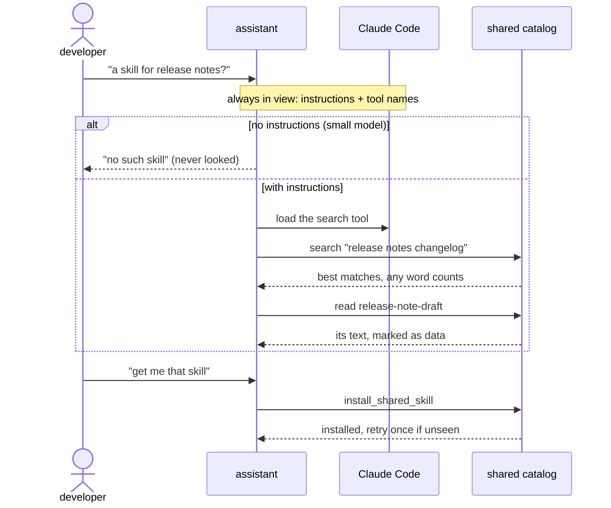
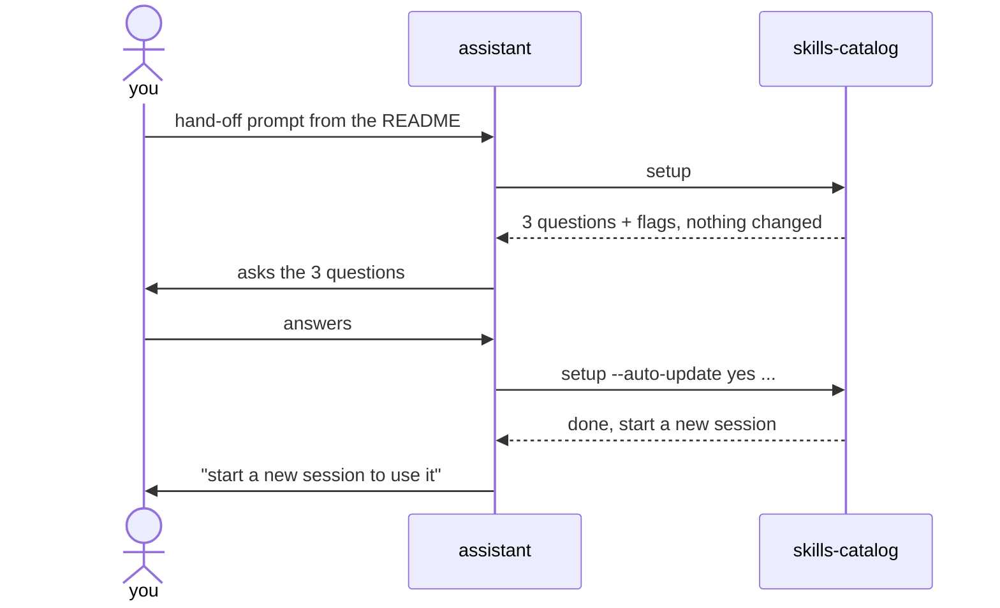

# Agent experience: what made assistants use the catalog well

The catalog is agent-first: a person asks their assistant ("is there a skill for release notes?", "get me that skill",
"update my skills") and the assistant does the work through the catalog's MCP tools or its CLI. So the words an assistant
sees (tool names, descriptions, the server's instructions, results and errors) are product surface, and we tested them on
real assistants before and while the catalog was built.

Every word lives in one file, `surface.yaml`, which the MCP server and the CLI render. It holds several variants so each
layer can be compared on its own; the `recommended` variant is what ships. The contract (`contract.md`) owns the
operations and their shapes; this page explains the words.

## How we tested

- **A stand-in catalog** with the MCP tools and the CLI, loaded with the QA plan's 64-skill test corpus and searched with
  SQLite FTS5, as the real local catalog is. Every word came from `surface.yaml`, one variant at a time.
- **Real assistants:** headless Claude Code (2.1.284) with its normal built-in tools on, so the catalog's MCP tools are
  deferred behind tool search as in everyday use. Mostly Claude Haiku 4.5 (the smallest model we support, where wording
  matters most), and a few runs on Claude Opus 5.5.
- **Asked in plain words**, the QA plan's scenarios: find, a paraphrase, nothing matches, install, not found, what
  changed, update, publish, setup.
- **Safe by construction:** each run in a throwaway folder it can read but not leave; no shell when the catalog is
  reached over MCP; the assistant's own settings, its skills folder and the repository hashed before and after every run
  (a run that changed any of them would have stopped the round; none did); Claude Code's per-folder session and cache
  files removed after each run.
- **Checked before each round:** the catalog server is started with the exact settings the runs use; a run whose server
  didn't connect voids the round instead of counting as a failure (one round was voided this way).
- **Small numbers:** about 135 runs, roughly $5, 1 to 3 runs per case. These are directions, not measurements; the QA plan's
  runner measures them properly (more runs per case, every access setup).

## What an assistant sees, and when

Observed, not taken from documentation (a docs-based summary we were given was wrong on the first two rows):

| When | What | Size |
|---|---|---|
| Every session | the MCP server's instructions | ~260 tokens |
| Every session | the catalog's tool names only, without descriptions (deferred behind tool search) | ~110 tokens |
| Every session | a skill's name and description (for the companion skill, in the CLI setup) | ~90 tokens |
| When the assistant decides to use a tool | that tool's description and schema | ~235 tokens each |
| Per call | results and errors | a search page ~150-1,100 |

So a tool's **name** must work on its own, and the always-on text has to do the routing.

## Findings

### Tell the assistant the catalog exists

Without the server's instructions, Haiku answered "Is there a skill for writing release notes?" with "No, there's no
release notes skill" **without looking** (0 of 3): it checked only its own built-in skills. A false "no" is worse than a
detour. With five short lines of instructions: 3 of 3, one search, no detour. Good tool descriptions alone didn't help
(0 of 2), because deferred tools are never opened if the assistant doesn't think to look. Opus passed either way.
In the MCP setup the instructions replace the companion skill (with the skill and no instructions: 1 of 2; the other run
asked "would you like me to search the catalog?"). The companion skill stays for the CLI setup (2 of 2).

### No tool called "get"

People say "get me the release-note-draft skill" and mean install it. With a tool named `get_shared_skill`, the assistant
read the skill and stopped (0 of 2). With `read_shared_skill` and `install_shared_skill`: installed, 2 of 3. The names
share one idea: *shared* = in the catalog, *installed* = on this machine.

### Search counts any word

Assistants search with any-of-these-words queries ("release notes changelog sprint changes customer"). With all-words
matching, a paraphrased ask took 3 to 13 searches, and one run concluded wrongly. Ranking by any word (common words
dropped): **one search, 3 of 3**, and "nothing matches" still held for an unrelated ask. "Nothing matched" now means no
word matched.

### Nothing matched exactly

Any-word ranking lets one shared word through: "graphql schema" finds a SQL migration skill by "schema". So a search page
says when no skill matched every word, each card names the words it shares, and the instructions tell the assistant to
say nothing matched exactly and offer the closest only as close. Asked "Is there a skill for designing a GraphQL
schema?": 3 of 3 said the catalog has none, and none presented the SQL skill as a fit. The check uses the same stemming
as the search index: without it, "review pull request" counted as a partial match for "reviewing pull requests", and an
assistant would have been told nothing matched.

### Suggest only similar spellings

On a name that doesn't exist, a search-based "closest match" was relayed as if it were the skill. Suggestions now come
from spelling only (`relase-note-draft` → `release-note-draft`).

### An installed skill works after a moment

Claude Code picks up a newly installed skill within the session, a moment after the install returns: the first attempt
said "Unknown skill", the second worked. The install result says to try once more.

### Results say what to do next

Each result says what it matched and how, the next step, and when to give up ("search once more with different words;
if that finds nothing either, tell the user"). Skill text is fenced and labelled as data from its publisher.
Assistants don't see a JSON dump; the MCP server and the CLI render the same sentences.

### Name the command in the hand-off prompt

"Set up the skills catalog for me. Turn auto-updates on." sent one assistant to **Claude Code's own settings**: it tried
to change Claude Code's auto-update setting (blocked in the trial; a person would have seen a normal-looking permission
prompt). With the command named in the prompt, 9 of 9 ran ours first. The README gives two prompts:

- Guided: *Set up our team's Skills Catalog on this machine: run `skills-catalog setup` and ask me the questions it prints.*
- Fast: *Set up our team's Skills Catalog on this machine with the defaults: run `skills-catalog setup --yes`.*

### Setup without a terminal

With a plain interactive wizard, the assistant handed the job back ("run it in your terminal"): 0 of 4. Without a
terminal, setup now changes nothing and prints its questions, each with the flag that answers it (exit code 3): the
assistant relayed them faithfully (3 of 3), and the fast prompt set everything up in one step (3 of 3).

### One name: skills-catalog

The product, the MCP server, the npm package and the CLI are all `skills-catalog`. Not `skills`: that is already a
popular public CLI for agent skills, which assistants know, so "run skills setup" could reach the wrong tool.

### Setup's result leads with the next step

The one thing left for the person ("start a new Claude Code session; this one can't use the tools yet") comes first,
and the count says "64 skills to search; none installed yet" (one run had reported "64 skills installed").
Relayed 2 of 3 before, 3 of 3 after.

### Internal errors: no traceback

When our stand-in crashed on a bug, assistants went to fix it: they tried to edit the tool's source and our design
files (blocked). An internal error now says it's a bug in `skills-catalog`, nothing on the machine needs fixing, not to
edit its files, and to tell the person; the details go to a log file.

### Held updates: one reason per file

Auto-update is on by default, and an update that could change what runs on the machine waits for the person. The
assistant gets one plain reason per file ("it adds scripts/lint.sh, which can run on this machine"), "was NOT
installed", and "do not take it yourself". Asked "Update my skills.": **6 of 6 relayed the reason and asked; 0 of 6 took
it on their own.** Taking it is a separate tool, `accept_held_update`, with a confirm value tied to that exact update;
setup never pre-allows it, so the assistant's permission prompt is the person's consent.

### Review notes on search cards

A card is silent when the rules review found nothing; otherwise a few words right after the name ("Review: includes
something that can run (scripts/lint.sh)"). Placed at the end of the card, the note reached the answer 1 time in 2;
after the name, 2 in 2. On a test skill whose description tries to steer the assistant, no run followed it; with the
note, both runs warned the person, and without it one run recommended the skill with no warning.

### Local edits are replaced

For now, an update replaces the installed copy, like most things installed on a machine; the words say so ("local edits
are lost") instead of promising otherwise. Detecting local edits later needs no new data.

### Publishing: preview first

"Publish my skill in ./my-skills/standup-notes": 3 of 3 previewed, showed the files to send and the files skipped (`.env`,
`.git/`), asked, and did not publish in the same turn. A marker string planted in `.env` never reached a tool result, an
answer or storage. A suspected secret: 2 of 2 told the person the file and line without repeating the value.

### Error fixes: propose, then wait

A fix inside an error message is an instruction. "Fix: add a line `description: …`" sent 2 of 2 assistants to write a
description into the person's SKILL.md themselves. Since the description is what teammates search on, the fix now says
"propose a one-line description to the person … add it only once they agree": 3 of 3 proposed and asked, 0 of 3 edited.

### Bare skill names

"What changed in release-note-draft recently?" (without the word "skill"): 0 of 3 looked in the catalog; they searched
local files and git. One more line of instructions (a name that looks like a skill, or "what changed", means check the
catalog first): 6 of 6, one call to the version list.

### Telling the person about a held update

An update held while nobody was there (at night, from the session-start sync) must reach the person next time. A notice
in the server's instructions reached the answer 0 of 5 on Haiku when the first ask was about something else (Opus 1 of 1).
Claude Code's session-start hook does it reliably: while something waits it prints a message for the person, whatever
the model does, and a line of context the assistant relayed 2 of 2. Setup adds that hook for Claude Code; other MCP
clients keep the instructions notice.

### Harness stumbles

Haiku sometimes stumbles on Claude Code's own tool search (sending the user's words to it, reloading tools it already
has). That's not the catalog's wording; the QA plan counts these separately so they don't hide a wording effect.

## Cost for the assistant

About 370 tokens per session are always in view (instructions and tool names); each tool adds ~235 when first used; a
search page of 10 cards is about 1,100 tokens (the right skill was in the top 3 in every trial, so the default is 10).

## Still open

- The QA runner's comparison of variants, with enough runs per case to measure rather than indicate.
- How a Claude Code terminal shows the session-start hook's message to the person (checked by eye).
- Whether a local edit should be protected on update: an open question for the presentation.
