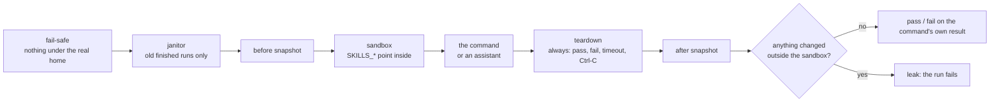

# qa: the skills catalog's QA tools

Tests for the catalog, and the tools that run them without ever leaving a trace on the machine. Everything here
follows the QA plan: tests first, reproducible, and every run cleans up after itself.

## Run it

Node 24.15 or later. From this folder:

| Command | What it does |
|---|---|
| `npm install` | Local dependencies only |
| `npm run check` | Typecheck and every test. Nothing touches your machine: each test builds a fake one in a temporary folder |
| `npm run mutate` | Puts back known bugs one at a time; the tests must catch every one. Stops first if the suite is red |
| `node src/cli.ts run -- <command>` | Runs a command in a fresh sandbox and checks that nothing outside it changed (files, settings keys, processes, ports) |
| `node src/cli.ts janitor --dry-run` | Lists the old, finished runs it would remove; without `--dry-run`, removes them |
| `node src/cli.ts agent --surface <surface.yaml>#<variant> --mcp "<server command>"` | Asks a real assistant each scenario in `golden/agent-scenarios.yaml` and scores its trace. Spends money on your Claude login (each run is capped); a pre-flight runs first |
| `node src/cli.ts trace-check` | Every requirement in `../requirements/` has an automated check, and every golden reference resolves |
| `node src/cli.ts scrub-trace <trace.jsonl>` | Replaces the home folder, the sandbox path and session ids in a trace, before it becomes a test fixture |

Live checks with a real assistant run only when you ask: `QA_LIVE=1 npx vitest run test/agent-live.test.ts`.
The check of `qa run` on the real machine is a script, run by hand: `node test/live/qa-run-real.ts`.

## How it stays safe

- **Tests never use the real machine.** Every function that creates, checks or deletes takes a machine (its tmp folder,
  home and Claude Code's folders) explicitly. Only the command line picks the real one, and it refuses to in a test
  process; tests pass `--fake-machine <dir>`. A test process that asks to create or delete anything under the real home,
  the real Claude tmp folder or the real sandbox base fails before anything is looked at.
- **No secrets reach a run.** Every process a run starts (the command, the assistant, the MCP servers) gets only an
  allow-listed environment (`PATH`, `HOME`, `USER`, `LOGNAME`, `SHELL`, `TMPDIR`, `LANG`, `LC_*`, `TERM`,
  `SKILLS_*` (set by the sandbox, never passed from yours), `QA_*`); tokens and keys never pass. The assistant keeps the real `HOME`, where its login lives. Each assistant run
  plants a marker under the usual secret names in its own environment, and a safety rule checks it never shows.
- **The assistant only by its full path.** `qa agent` starts Claude Code from `--claude <full path>` (default
  `~/.local/bin/claude`), never a name looked up on `PATH`. The path is resolved to its real file, which must be
  executable; on macOS a copy whose quarantine mark was never approved is refused before it runs, even for `--version`
  (running one shows you a "downloaded from the Internet" prompt). The pre-flight prints the path and version it will use.
- **One place deletes: `src/safe-delete.ts`.** Run folders only inside `<tmp>/skills-catalog-qa`, which must be a real
  directory you own, mode 0700, at its exact real path; each run folder is named by a run id
  (`20260929T001234Z-1a2b3c4d`) and holds a `run.json`. A link is removed, never followed.
- **Outside the sandbox, only the run's own leftovers,** at exact paths built from its own sandbox: the project and tmp
  folders Claude Code names after it, and session folders for the ids in the run's own stream, when they're UUIDs and
  weren't there before the run. Nothing is globbed.
- **The janitor never guesses.** A run whose process is alive, a folder without `run.json`, a leftover whose run folder is
  gone, a session folder named in a sandbox file: each is reported, never deleted.

Exit codes of `qa run`: the command's own code, `2` something was left behind, `3` a safety check refused to start,
`124` timeout, `130` Ctrl-C. `qa agent`: `0` all pass, `1` a failure or nothing ran, `3` stopped, `130` Ctrl-C.

## What's here

| Folder | What |
|---|---|
| `golden/` | Hand-written expected results: skills, histories, queries, the update gate's cases, the assistant scenarios, answer phrasings |
| `traceability.yaml` | Each requirement, its oracle and its checks |
| `src/` | The tools: `run`, `janitor`, `check` (before/after), `sandbox`, `safe-delete`, `agent/` (the scenario runner and its scorer) |
| `test/` | Their tests; `test/machine.ts` builds the fake machines |
| `fixtures/traces/` | Recorded, scrubbed assistant traces with hand-written scores |
