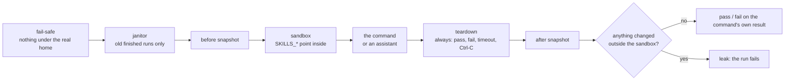

# qa: the skills catalog's QA tools

Tests for the catalog, and the tools that run them without ever leaving a trace on the machine. Everything here
follows the QA plan: tests first, reproducible, and every run cleans up after itself.



## Run it

Node 24.15 or later. From this folder:

| Command | What it does |
|---|---|
| `npm ci --ignore-scripts` | Local dependencies only, exactly as locked, no install scripts |
| `npm run check` | Typecheck and the tests, except the slow ones listed with their times in `test/slow.json`. Nothing touches your machine: each test builds a fake one in a temporary folder |
| `npm run test:slow` / `npm run test:all` | The slow tests only / every test |
| `npm run mutate` | Puts back known bugs one at a time; the tests must catch every one. Stops first if the suite is red |
| `node src/cli.ts run -- <command>` | Runs a command in a fresh sandbox and checks that nothing outside it changed (files, settings keys, processes, ports) |
| `node src/cli.ts janitor --dry-run` | Lists the old, finished runs it would remove; without `--dry-run`, removes them |
| `node src/cli.ts agent --surface <surface.yaml>#<variant> --mcp "<server command>"` | Asks a real assistant each scenario in `golden/agent-scenarios.yaml` and scores its trace. Spends money on your Claude login (each run is capped); a pre-flight runs first |
| `node src/cli.ts trace-check` | Every requirement in `../requirements/` has an automated check, and every golden reference resolves |
| `node src/cli.ts scrub-trace <trace.jsonl>` | Replaces the home folder, the sandbox path and session ids in a trace, before it becomes a test fixture |
| `npm run demo` | The one-click demo: two developers share skills in one terminal window, step by step (below) |
| `npm run map` | Checks the system map (`../docs/map/map.yaml`) against the code, then builds its page (`../docs/map/index.html`) and pictures (`../docs/pictures/map-*.svg`); `npm run check` fails while they're stale or disagree |

Live checks with a real assistant run only when you ask: `QA_LIVE=1 npx vitest run test/agent-live.test.ts`.
The check of `qa run` on the real machine is a script, run by hand: `node test/live/qa-run-real.ts`.

## The one-click demo

> **Deferred from the README (2026-09-30).** Its stand-in assistants print each tool result as it comes, raw markdown
> and all, where a real assistant shows the person a rendered reply. The README shows real Claude Code screens instead
> (`qa/reels/record.sh stills`). The demo still runs as described here.

Two developers, ana and bob, share skills through one catalog, in one terminal window. You watch each step and what
it should show. Their assistants are stand-ins for now: each makes the calls an assistant would, with no model (no
login, no cost), on the real catalog: its MCP server (this repository's own, one per developer) and, for installing
and updating, its command line. With `--core` they call the catalog's core in their own process instead, and the
installing and updating steps show as planned.

Needs Node 24.15 or later, tmux 3.2 or later, lsof, and macOS or Linux. On macOS, tmux from Homebrew
(`brew install tmux`; lsof comes with macOS); on Linux, from a distribution whose tmux is 3.2 or later, e.g. Debian 12
or Ubuntu 22.04 and later (`sudo apt install tmux lsof`). Without lsof, the demo stops before it starts and says so:
it uses lsof to check that it cleans up after itself. It's laid out for a terminal of about 200 columns by 50 rows (a
laptop screen, full size); it plays down to 80 by 24, with more lines wrapped. Once, from this folder:
`(cd ../core && npm ci --ignore-scripts) && (cd ../client && npm ci --ignore-scripts) && npm ci --ignore-scripts`
(without `../client` installed, the demo runs as with `--core`, and says so). Then:

```sh
npm run demo
```

```
┌ Developer 1 · ana (scripted) ─┬ Developer 2 · bob (scripted) ─┬ Steps ──────────────────────┐
│ › publish v2 of release-note… │ › what changed in release-no… │ ✓ 4  ana publishes v2, which│
│ ● publish_skill_to_catalog    │ ● diff_shared_skill_versions  │      adds a script          │
│   │ Published release-note-d… │   │ … Can run something new o…│ ▶ 5  bob compares v1 and v2 │
│                               │     this machine: yes         │      see: "Can run something│
├ Catalog server log ───────────┴───────────────────────────────┴─────────────────────────────┤
│ 03:29:11  bob   diff_shared_skill_versions   adds something that can run   release-note-dr…│
└─────────────────────────────────────────────────────────────────────────────────────────────┘
```

| Pane | What it shows |
|---|---|
| Developer 1 · ana (scripted), Developer 2 · bob (scripted) | Each developer's assistant, with what they ask it. For now a scripted stand-in: it makes the calls an assistant would, on the real catalog, and shows the catalog's own words. A publish is the catalog's preview, then the person's yes (dimmed), then the publish. No model, no cost |
| Steps | Each step and what to look for; ✓ once the demo saw it too, ◌ for a step whose part isn't in this demo |
| Catalog server log | One line per call: when, who, which tool or command, what happened. Never what anyone typed. The catalog's servers and command line write it; with `--core` the stand-ins do, in the same words (its first line says so) |

| # | Step | You should see |
|---|---|---|
| 1 | both install the skill manager | ◌ not in this demo: it wires each assistant to the catalog itself |
| 2 | ana publishes release-note-draft and sql-migrations | "Published release-note-draft v1 to the shared catalog", in ana's pane |
| 3 | bob finds it and installs it | "1 of 2 skills match", then "Installed release-note-draft v1", in bob's pane (with `--core`, installing is planned) |
| 4 | ana publishes v2, which adds a script | "Review: includes something that can run (scripts/collect.sh)", in orange, in ana's pane |
| 5 | bob compares v1 and v2 | "Can run something new on this machine: yes", in orange, in bob's pane |
| 6 | bob publishes his fix over ana's skill | "not_owner: release-note-draft belongs to ana", in bob's pane; nothing is published |
| 7 | bob searches for a graphql schema skill | nothing matches exactly; the closest only shares "schema", in bob's pane |
| 8 | an update that can run something new waits for bob | "was NOT installed", then bob's own "Take it? (y/N)" answered y, and "Took it:", in bob's pane (with `--core`, planned) |

It plays on its own, a few seconds per step. **Enter**: the next step now. **p**: pause. **q** or **Ctrl-C**: stop,
remove everything and say whether anything was left behind (before the last step, it also says after which step it
stopped and how many weren't played). The line above the keys in the Steps pane says what the demo is doing: starting,
playing, pausing (it stops before the next thing it types), paused, or waiting for Enter. While paused, Enter finishes
the step it's in (or, between steps, plays the next one) and pauses again; p carries on.

Exit codes: 0 every step seen or planned; 1 a step missed (it says what didn't show), a flag refused (it says which) or
the director failed (it says why); 2 something was left behind; 3 a pre-flight check refused to start (it says why);
124 timed out (headless only: a run with a window has no time limit, a headless one stops after 30 minutes); 130
stopped with q or Ctrl-C before the last step. Each run keeps each pane's text, the log and its last line
(`status.txt`) in `out/demo/<run-id>/`.

Options go after `--`, so npm passes them on:

| Option | What it does |
|---|---|
| `npm run demo -- --step` | Waits for Enter before each step |
| `npm run demo -- --only 5,6` | Only those steps (the steps before them run first, at once) |
| `npm run demo -- --pace <seconds>` | The pause after each step (default 3) |
| `npm run demo -- --close-after <seconds>` | Closes the window by itself that long after the last step, as q would then (for a recording); without it, it waits for q |
| `npm run demo -- --headless` | No window: plays straight through; the panes' text is in `out/demo/<run-id>/` |
| `npm run demo -- --out <folder>` | Where each pane's text, the log and `status.txt` go, instead of `out/demo/<run-id>/`; a new or empty folder |
| `npm run demo -- --size <columns>x<rows>` | The window's size (default: this terminal's; headless, 200x50) |
| `npm run demo -- --core` | The stand-ins call the catalog's core in their own process, not its MCP server |
| `npm run demo -- --server "<command>"` | Another catalog MCP server (its words split at spaces, the first an absolute path) |

The demo runs inside `qa run`: its own tmux server (never yours) in a fresh sandbox, panes whose `PATH` is only
`/usr/bin` and `/bin` and whose home is inside the sandbox, and at the end the check that nothing outside the sandbox
changed, leftover processes and open ports included (on Linux, the processes are read from /proc).

## How it stays safe

- **Tests never use the real machine.** Every function that creates, checks or deletes takes a machine (its tmp folder,
  home and Claude Code's folders) explicitly. Only the command line picks the real one, and it refuses to in a test
  process; tests pass `--fake-machine <dir>`. A test process that asks to create or delete anything under the real home,
  the real Claude tmp folder, the real Claude cache or the real sandbox base fails before anything is looked at.
- **No secrets reach a run.** Every process a run starts (the command, the assistant, the MCP servers) gets only an
  allow-listed environment (`PATH`, `HOME`, `USER`, `LOGNAME`, `SHELL`, `TMPDIR`, `LANG`, `LC_*`, `TERM`,
  `SKILLS_*` (set by the sandbox, never passed from yours), `QA_*`); tokens and keys never pass. The assistant keeps the real `HOME`, where its login lives. Each assistant run
  plants a marker under the usual secret names in its own environment, and a safety rule checks it never shows.
- **The assistant only by its full path.** `qa agent` starts Claude Code from `--claude <full path>` (default
  `~/.local/bin/claude`), never a name looked up on `PATH`. The path is resolved to its real file, which must be
  executable; on macOS a copy whose quarantine mark was never approved is refused before it runs, even for `--version`
  (running one shows you a "downloaded from the Internet" prompt). The pre-flight prints the path and version it will use.
- **One place deletes: `src/safe-delete.ts`.** Run folders only inside `<tmp>/skills-catalog-qa`, which must be a real
  directory you own, mode 0700, at its exact real path; each run folder is named by a run id
  (`20260929T001234Z-1a2b3c4d`) and holds a `run.json`. A link is removed, never followed.
- **Outside the sandbox, only the run's own leftovers,** at exact paths built from its own sandbox: the project, tmp and
  cache folders Claude Code names after it, and session folders for the ids in the run's own stream, when they're UUIDs
  and weren't there before the run. Nothing is globbed. The cache folder holds the MCP servers' logs: an agent run keeps
  them beside the try's transcript (`traces/<try>.mcp-logs/`) before removing it, copying regular files only.
- **The janitor never guesses.** A run whose process is alive, a folder without `run.json`, a leftover whose run folder is
  gone, a session folder named in a sandbox file: each is reported, never deleted.

Exit codes of `qa run`: the command's own code, `2` something was left behind, `3` a safety check refused to start,
`124` timeout, `130` Ctrl-C. `qa agent`: `0` all pass, `1` a failure or nothing ran, `3` stopped, `130` Ctrl-C.

## What's here

| Folder | What |
|---|---|
| `golden/` | Hand-written expected results: skills, histories, queries, held updates' cases, the assistant scenarios, answer phrasings |
| `traceability.yaml` | Each requirement, its oracle and its checks |
| `src/` | The tools: `run`, `janitor`, `check` (before/after), `sandbox`, `safe-delete`, `agent/` (the scenario runner and its scorer), `map/` (the system map's check and build, with the diagram renderer vendored as `renderer.js` by `npm run vendor-renderer -- <bundle>`) |
| `test/` | Their tests; `test/machine.ts` builds the fake machines |
| `fixtures/traces/` | Recorded, scrubbed assistant traces with hand-written scores |
| `person-eval/` | What a real assistant shows the person: `run.sh <checkout> <out> [tries] [model]` walks ana's and bob's story with `claude -p` (costs a little); `node score.mjs [--history <file.jsonl>] <out…>` scores bob's answers (tables, marks, a box, one question, words and each ask's ceiling in `ceilings.json`, internal terms, still right) as k/n with 95% intervals, with what the run cost, one column per run; `--history` keeps one line per answer |
| `reels/` | `record.sh`: the README's reels, real Claude Code sessions recorded and checked screen by screen |
