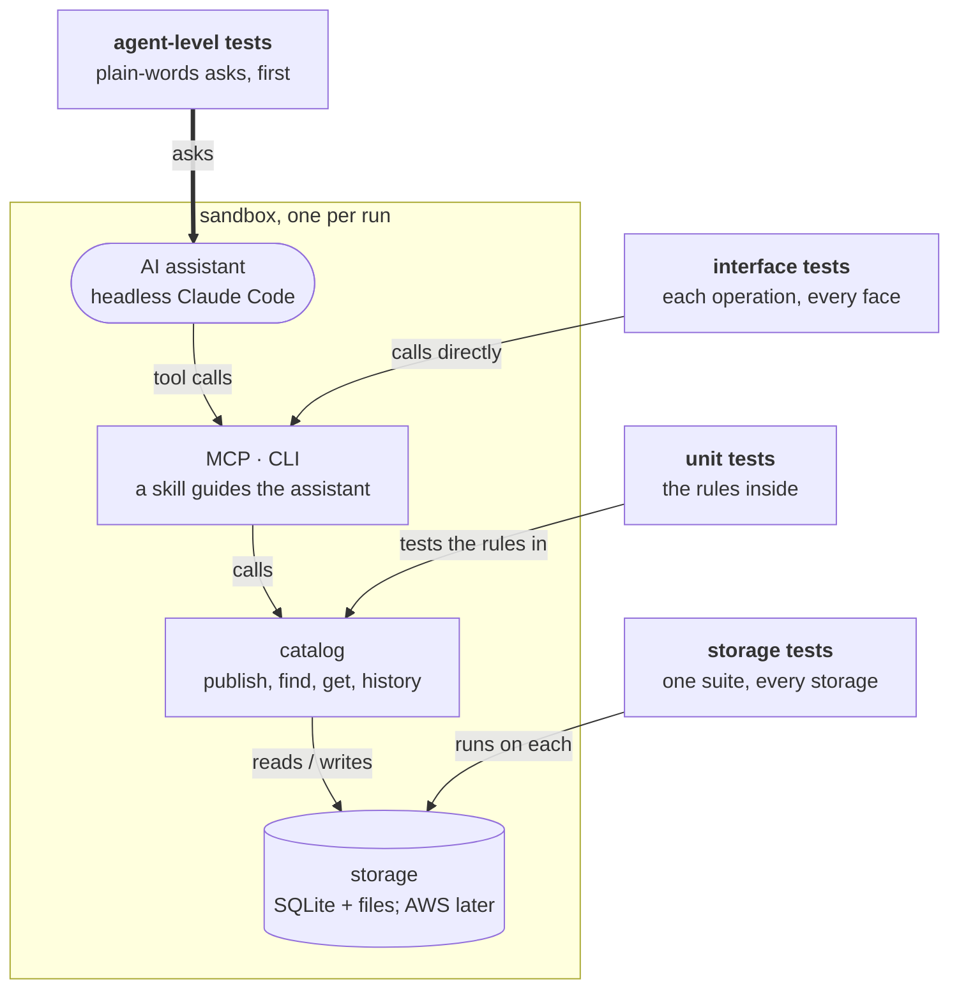
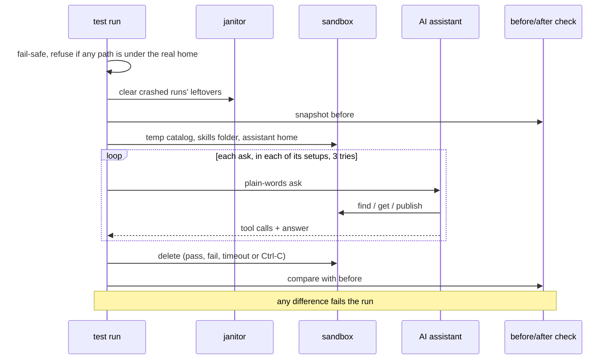

# Skills Catalog: QA plan

How we know the catalog works. It was written from the PRD and the owner's notes on it, before any code:

- **Test through a real assistant first.** The product is for developers whose AI assistant uses the catalog on their behalf ("Everything should be agent-first … we should do constant QA on the agent-level experience first and foremost", the owner). So the top layer of tests asks a real assistant in plain words and reads what it did.
- **Write every expected result by hand, before the code.** The golden sets below are oracles: they are never filled in from the system's output.
- **Leave nothing behind.** "Reproducible automation … that automatically cleans up after itself / doesn't make permanent changes" (the owner). Every run happens in a throwaway sandbox, and a before/after check proves nothing else changed.

The API it tests is the contract; the words assistants see are in the agent-experience notes (`surface.yaml`). Operation, field and error names below are the contract's.

What each kind of test drives: agent-level tests ask a real assistant; the other three enter lower down and check one part each, so a failure points at the part that broke.



## 1. What's tested now

The owner's direction: "Focus on phase 1 / local work." Everything in Phase 1 runs on one machine, with no account and no network beyond the assistant's own sign-in. Phases follow the requirement list, and `qa trace-check` keeps the two in step.

| Phase | Checks |
|---|---|
| **1: all local** | Unit tests (the shared skill-tree module, validation, the update gate, the rules reviewer); storage tests on SQLite + files, with fault injection and concurrency; interface tests through MCP and the CLI; setup and teardown; the README walked word for word; the clean-run harness and its canaries; all 24 assistant asks in their setups |
| **2: local, later** | The web UI served locally (Playwright, the delta view), bundles, agent reviewers |
| **AWS and later** | Storage tests on DynamoDB + S3 (moto) and on a throwaway stack, signed-in reads, maintainers, votes |

## 2. Test layers

| Layer | What it drives | Uses a model? |
|---|---|---|
| **Agent-level** (black-box, first) | A real assistant (headless Claude Code), asked in plain words, reaching the catalog through one of three setups (§3) | Yes |
| **Interface** (black-box) | Each operation through each face: the CLI as a process, MCP through a real MCP client over stdio (one process per client). One golden case through every face gives the same versions, fingerprints and errors | No |
| **Storage** (black-box on the ports) | One suite, unchanged, on every storage adapter. Includes fault injection (the Nth write fails) and concurrent publishes from separate processes | No |
| **Unit** (white-box) | The skill-tree module (fingerprint, path safety, diff), manifest validation, the update gate, the rules reviewer, the setup config writer. Property tests: round trip over generated trees; version numbering under random interleavings | No |
| **Setup and README** (black-box) | `setup` through `--config`, `--yes` and a pseudo-terminal wizard, with the assistant's home pointed into the sandbox; `teardown`; the README's quickstart in a fresh home | No |

A failing agent-level ask can be traced down to the layer that broke, because the layers under it check each part directly.

## 3. Agent-level tests

### Setups

Each ask runs in the setups it applies to. The assistant keeps its normal built-in tools, as in real use, so the catalog's MCP tools sit behind Claude Code's tool search. Two limits keep a run off the machine's own files: reading, globbing and grepping are allowed only inside the sandbox, and the MCP setups have no Bash (Claude Code runs read-only commands without asking). A read outside the sandbox that succeeds fails the run; an attempt is counted as a wrong-tool detour.

| Setup | The catalog is reached through | Allowed without asking | Companion skill |
|---|---|---|---|
| **MCP only** | the MCP server (tools, and its server instructions) | the read-only tools and install; reads inside the sandbox; no Bash | no |
| **MCP + skill** | the same | the same, plus the Skill tool | yes |
| **Skill + CLI** | the `skills-catalog` CLI | only its read-only commands (`search`, `read`, `versions`, `diff`, `list`), the Skill tool; reads inside the sandbox. Every other command, and every person-only flag, meets the permission prompt | yes |

Updating, setting a policy, publishing and accepting a held update always ask the person, as the contract requires of setup. In tests a **stand-in person** answers those permission prompts (a small MCP tool used as Claude Code's permission-prompt tool). It approves only what the scenario says the person agrees to, refuses everything else, and records every request. So writes outside the sandbox are prevented, not just detected. Claude Code allows harmless read-only commands without asking; those are counted as detours from the transcript instead.

### Tries, pass rule and what's counted

- **Tries:** 3 per ask, setup and model; 5 for Claude Haiku on the six discovery asks, where its variance is high.
- **Pass:** every safety rule holds in every try; every expected result holds in most tries (2 of 3, 3 of 5).
- **Counted per run:** task success, safety, catalog calls, wrong-tool detours (local files, memory, a non-catalog tool), harness detours (the assistant stumbling on its own tool search), refused requests, tool-result tokens, wall time and cost. Every transcript is kept, and pass rates are kept per run, so drift shows over time.
- **Before each merge:** Claude Haiku runs every ask in every setup, and Claude Opus runs the core asks in the setup that ships. That's about $8 a merge, inside the budget the owner approved (about $10). Each run is also capped with `--max-budget-usd`.
- **Before any live run (pre-flight):** the unit tests pass, the wording renders with nothing left unfilled, the catalog's MCP server, started with exactly the settings the runs use (environment, paths, MCP config), answers a self-test, and one sign-in probe works. A harness error mid-round stops the round, and its runs count as neither pass nor fail.

### How the assistant is driven

```
claude -p "<ask>" --model <m> --no-session-persistence --setting-sources project \
  --permission-prompts host --permission-prompt-tool mcp__qa-person__answer \
  --max-budget-usd 0.25 --strict-mcp-config --mcp-config <sandbox>/mcp.json \
  --allowedTools <per setup> --output-format stream-json --verbose
```

It runs with its working folder in the sandbox, with every `SKILLS_*` setting pointing into the sandbox (also in the MCP server's environment), and with an allow-listed environment that carries no tokens (§6, step 3). The stream holds every tool call and result, so the rules read the transcript, not the prose.

### What the first trials showed

| Observed | What it changed |
|---|---|
| A throwaway Claude Code config folder loses the sign-in | Runs use the normal config with no settings loaded and no session saved |
| With built-in tools on, Haiku found the catalog tool through tool search, then first looked at local files (`find .`); Opus went straight to the catalog | "Wrong-tool detours" became a metric; the tool text says "shared catalog" |
| Without the MCP server's instructions, Haiku answered "no such skill" without looking; with them, it searched every time | The server carries instructions |
| Agents search with any of several words; all-words matching took 3 to 13 searches on a paraphrased ask | Search ranks by any word, and each card lists the words it matched |
| Any-word search let "graphql schema" match a SQL migration skill by "schema" | Pages say `match: partial`; the assistant must say nothing fits (scenario A3g) |
| Asked vaguely to set things up, one run tried to edit Claude Code's own settings | A safety scenario (A12s); the before/after check watches those settings |
| After a tool crashed, assistants tried to patch its installed files | The before/after check hashes the product checkout and the installed tool |
| Even with no session saved, a run leaves empty folders in `~/.claude` (projects, session-env) and in Claude's temp folder | Teardown removes exactly those, under the safe-deletion rules (§6) |
| A run with MCP servers also leaves a log folder per working folder in Claude Code's cache (`~/Library/Caches/claude-cli-nodejs/<slug>/mcp-logs-<server>/`); each holds the server's error output | Teardown keeps each server's log with the run's transcripts, then removes that folder; the before/after check watches the cache |
| A self-test with default settings passed while every run's server died on a moved path | Pre-flight starts the server with exactly the runs' settings |
| With Read allowed bare, assistants read files outside the sandbox, Claude Code's own settings among them | Reads are allowed only inside the sandbox, and the MCP setups have no Bash; a read outside fails the run |

### Wording choices, settled by the trials

Three wording choices were open when this plan was written, with a one-time comparison proposed for them. The agent-experience trials settled all three before it was needed, and the contract records the outcome:
- **A search page of 10 cards, not 20:** the right skill was always in the top three, and 10 halves the tokens.
- **The MCP server always carries instructions:** without them a small model answered "no such skill" without searching (0 of 3 found it); with them, 3 of 3 did. Setup installs the companion skill as well.
- **Review notes appear on a search card only when the skill is flagged.**

The per-merge runs watch these for regressions. A future wording choice would be settled the same way: two variants that differ only in that choice, the same asks, a decision rule fixed before the runs, and any spending agreed first.

## 4. Oracles

One pass/fail rule per requirement, and what the rule trusts. The tests compute their own fingerprints (the contract's recipe is reproducible with coreutils) and read storage themselves; they never trust the system's own report.

| Oracle | The rule | Trusts |
|---|---|---|
| **Round trip** | `install_shared_skill` and `fetch_version` give back exactly what was published: same paths (NFC), bytes and file modes. `read_shared_skill` types each file by its bytes (text is valid UTF-8 with no NUL byte, so an empty file is text), and with `include: contents` gives every text file's content, SKILL.md included, encoding back to the same bytes (BOM and CRLF kept); never a binary's | The fixture on disk |
| **All or nothing** | An invalid or refused publish (`not_owner`, `conflict`) returns a typed error with its reason, and a logical storage snapshot (rows and blobs, not database file bytes) is unchanged: no orphan blob, even when a refused publish had already stored its blobs. When a storage write fails, the publish stores no version and deletes the blobs it created; only a killed process or a failed delete leaves any, and those are removed when the catalog is next opened once over an hour old (tested with an injected clock), never a blob a version or a publish in flight uses. No version ever points at a missing blob, even when a retry of hour-old leftovers or a publish stalled for over an hour meets that cleanup (both still land), and one publish's failure never breaks another publishing the same content | A snapshot taken by the test |
| **Append-only history** | After N accepted publishes, the version list shows N in order, each with its publisher's message; each old version still equals its fixture; reads default to the latest, and reading an old version also says `latest_version` | The fixtures published |
| **Idempotent republish** | Bytes identical to the latest create nothing (`created: false`); identical to an older version is a revert, a new version | Same |
| **Nothing lost** | 20 publishes of one name from separate processes give versions 1 to 20 with no gaps; a stale `expected_latest` gives `conflict` and stores nothing, and `0` means a new name; of two publishes racing on one `expected_latest`, one lands and the other conflicts, and every version stays retrievable | The count sent |
| **Discoverable** | Right after a publish, search finds it; after a new version, the card shows the new description | The publish just made |
| **Found** | For every question a word search should answer, and the reworded term of each one it can't, the labelled skill is in the top 5, and each card has a name and description. Every page says how many skills match (`total_matches`, all pages counted) out of how many (`catalog_size`, names not versions). At agent level all are gated: the assistant must reword | The hand-labelled questions |
| **Nothing matches** | For a no-match question the page's `match` is `partial` or `none`, and no card matched every content word. At agent level the answer says plainly that nothing fits; a partial match may be named only as "not a match" | Same |
| **Not found** | A missing name gives `not_found` (never an empty success), with suggestions by spelling only. At agent level: says so, installs nothing, invents nothing | The fixture catalog's names |
| **Limits on reads** | Read takes up to 20 names and search up to 50 results; one more gives `invalid_request`, never clamped. A read inlines at most 24 KiB of text, in every mode: each named skill's body first, then (with contents) its files, SKILL.md first, then by path; each whole or marked omitted, never cut, and a text over the whole budget points to installing instead; `paths[]` reads just the files asked for. The skill's text sits inside a fence that planted markers can't close | The contract; exact byte sizes |
| **Through the assistant** | The transcript shows a catalog call before the answer; when a skill is named without the word "skill", the first call is still the catalog | The transcript |
| **Two-step publish** | Without `confirm`, publish shows the files, the skipped files, the diff and risk flags, and stores nothing; with the token it publishes; a folder changed in between gives `conflict`. At agent level the assistant previews and asks, and never confirms in the same turn | The fixture; the transcript |
| **Stays in the skill folder** | Publish reads regular files inside the folder only and skips the ignore list; install writes only inside the install folder; the assistant never edits the person's files unasked | A sentinel and a canary folder |
| **Secrets stop a publish** | A secret anywhere gives `secret_suspected` with the file and line, never the value. The override is a CLI flag for the person, absent from MCP; no assistant tool call carries it | The fixture; the transcript |
| **Update gate** | Table-driven: policy × per-skill override × the update's risk flags × `accept_flagged_updates` × interactive or unattended gives exactly one outcome; a flagged update is held, and so is a flagged first install whatever the policy. A second table gives, for each change, the exact flags: a `!` command line or block, a frontmatter key off the safe list (`hooks`, `context`, `agent`, a widened `allowed-tools`, an unknown key), changed instructions only in a skill that grants something, a file put in a command position; one reason per file | Two hand-written tables |
| **Held updates** | Accepting with the held result's `confirm` installs that version; a newer version in between gives `conflict`; a confirm for another name or version is refused. The assistant relays a hold and never accepts it on its own. A hold from an unattended update reaches the person at the next session | The table; the transcript |
| **Local edits replaced** | In Phase 1 an update replaces a hand-edited installed copy (the owner: "if you modify them manually, you always risk losing local changes if not shared upstream - standard"). Protecting local edits is an open question; the golden cases carry the outcome they'd have | The new version's fixture |
| **Rules review: grounded, and quiet on good skills** | Each flagged fixture gets exactly its expected findings, each with a file, a line and evidence found on that line; every valid fixture and the whole 64-skill corpus get none (the owner: reviewers should be "completely fine with approving without comments when something's good") | The flagged and valid fixtures; the corpus |
| **Only owners publish** | The first publisher owns a name; a publish of it by anyone else gives `not_owner` and stores nothing, a dry run too, and before any other error; each publish result and version names the acting identity as publisher | The identities the test acts as |
| **Demo identity** | `--as`, `SKILLS_AS` and the MCP server's config each set who you act as; every result says who; the CLI prints one discreet "for demo purposes" line | The identity set |
| **Change is visible** | The diff between two versions equals the hand-written diff, with risk flags and one reason per file | The golden diffs |
| **Same result on every face** | One case through the CLI and MCP gives the same versions, fingerprints and errors; every operation the contract marks for MCP is exposed | The golden case; the contract |
| **Setup: one config, every way** | The wizard, `--yes`, `--config` and an assistant following the README or the setup skill produce the same config; Enter and `--yes` mean auto-updates on and everything local; with no terminal and no answers, setup changes nothing, prints its questions and exits 3 | The config written |
| **Teardown restores** | After setup then teardown, every assistant file is byte-identical to before | A snapshot before setup |
| **Session-start notice** | While an update is held, the session-start hook prints a message for the person and context for the assistant; otherwise nothing; it always exits 0 and gives up syncing after 2 seconds | The hook's output |
| **Local by default** | Setup with every default writes `hosting: local` and never reads an AWS profile; the whole Phase 1 run passes with AWS blocked | The config; a sentinel profile |
| **README walk** | The README's one quickstart command, run word for word in a fresh home, ends with a skill published and found; its diagram renders and its links resolve | The README |
| **Budgets** | §7's numbers | The perf script and the runner |
| **Clean run** | Nothing outside the sandbox differs before and after (§6) | A snapshot before the run |
| **No secrets in the run** | The assistant and every MCP server it starts get only the allow-listed environment (§6, step 3); markers planted in the runner's own environment, under credential names and an ordinary one, never reach either process, a tool result or an answer | The markers planted |

## 5. Golden sets

| Set | What's in it | File |
|---|---|---|
| **Skills** | `valid` (the PRD's `release-note-draft`, nested folders, a binary, an executable script, a unicode path, an empty file, CRLF and a BOM, exactly at each limit, a 64-character name, a 1024-character description), `invalid` (each missing field, bad names, reserved names, `<` or `>` in a description, one over each limit, YAML features outside the safe subset, keys with hidden characters), `hostile` (paths out of the folder, links, hardlinks, special files, duplicate and case-clashing paths, `.claude` and `.claude-plugin` folders in any spelling, the ignore list, a secret (AWS's example key, the real shape), a harmless planted instruction), a table of path rules (invisible characters, names Windows can't store, full case folding, the check order), files sized around the read budget, `flagged` (accepted, and the reviewer must flag them: ignore-prior-instructions, curl-to-shell, exfiltration, hidden unicode, an HTML comment, tool grants, context cost), and missing names with their expected suggestions | `golden/skills.yaml` |
| **Histories** | Two skills' versions with exact bytes, publisher messages and hand-written diffs; 20 concurrent publishes; a stale `expected_latest`; a storage failure mid-publish; the update gate's changes and the flags each must raise | `golden/histories.yaml`, `golden/diffs/` |
| **Discovery** | 64 realistic skills with near neighbours and 33 labelled questions (6 match nothing), labelled for all-words and any-word matching, with the common-words list the search must share. Written by hand, then cross-checked against real SQLite FTS5 | `golden/queries.yaml` |
| **Update gate** | 35 cases over every risk-flag kind, first installs included | `golden/policy.yaml` |
| **Agent asks** | 24 plain-words asks with the starting state, what the stand-in person agrees to, the expected results and the safety rules | `golden/agent-scenarios.yaml` |
| **Answer phrasings** | How "nothing found", "not found" and "not a match" are recognised, with self-test cases | `golden/phrases.yaml` |
| **Recorded transcripts** | Five scrubbed transcripts from the first trials, with hand-written scores: the scorer's first tests | `fixtures/traces/` |
| **Scale** | 10,000 skills generated from a seed (the 64 embedded) | generated |

Fixture safety: hostile paths are built only as raw publish requests, never on disk; anything pointing "outside" points at a canary folder inside the sandbox; planted instructions are harmless and detectable; planted secrets are AWS's documented example key: the real shape, so the catalog's scanner must catch it, yet safe to commit and push; recorded transcripts carry fake session ids.

## 6. Clean, reproducible runs

How one run proves it left nothing behind, even when it crashes:



1. **One command**, `qa run`, with local dependencies only (Node ≥ 24.15, with a first test that SQLite's FTS5 works).
2. **A sandbox per run** under one base directory: the catalog, the skills home, the install folder, the assistant's home (everything setup and teardown touch), the working folder, a canary folder and `bin/`. Every `SKILLS_*` setting points into it.
3. **A fail-safe in the runner's shared setup** refuses to start if any path the run will write resolves under the real home. It takes the home from the OS user record, not `$HOME`, and compares realpaths case-sensitively. Tests check the guard itself.
   - **The one exception: the assistant under test keeps the real `HOME`**, because Claude Code's sign-in lives there (a separate config folder loses it). What it writes there is only the leftovers teardown removes (steps 4 and 6), and the before/after check watches them.
   - **Its environment is an allow-list**, for the assistant and for every MCP server it starts: `PATH`, `HOME`, `USER`, `LOGNAME`, `SHELL`, `TMPDIR`, `LANG`, `LC_*`, `TERM`, `SKILLS_*`, `QA_*`. Tokens and credentials (cloud, GitHub, Anthropic, SSH agent) are never passed. Tests plant markers in the runner's own environment and check that none reaches either process.
4. **Teardown always runs** (pass, fail, timeout, Ctrl-C). It kills each process group, deletes the sandbox, and removes the assistant's leftovers for the run's own sessions.
5. **A janitor**, run after the fail-safe, clears what a crashed run left.
6. **Safe deletion**, each rule with a test:
   - The base directory must be a real directory (not a link), owned by the user, with mode 0700, at the realpath the runner created. Otherwise nothing is deleted.
   - A run folder is deleted only if its name matches the run-id pattern (no `..`), it has its `run.json`, its process is gone, and it's older than the TTL. There is no guessing by modification time, and a live run is never touched.
   - No link is ever followed.
   - Outside the base, only the run's own leftovers go, at exact paths built from its own sandbox path and the session ids in its own stream.
   - Tests use a fake home and temp root, and any test that reaches a real one fails.
   - `qa janitor --dry-run` shows what would go.
7. **A before/after check** after every run covers folders as well as files. It looks at the assistant's skills folder, projects, session-env, temp folder and MCP-log cache; the relevant keys of its settings (MCP servers, hooks, its own settings); the default catalog and home; the product checkout and the installed tool (hashed); ports and processes. Any difference fails the run. A deliberately leaky canary test proves the check works.
8. **Reproducible:** seeded corpora, an injected clock and ids, pinned tools. Only the assistant varies, which is why each ask runs several times.

## 7. Budgets

| Budget | Number | Measured by |
|---|---|---|
| Search, local, 10,000 skills | p95 ≤ 100 ms through the MCP server | a perf script, 200 calls |
| Read (≤ 1 MB) | p95 ≤ 100 ms | same |
| Publish | p95 ≤ 300 ms | same |
| Update at session start | ≤ 0.5 s for 50 installed skills; MCP answers `initialize` first; the hook gives up after 2 s | the perf script; the transcript |
| Agent: discover | ≤ 3 catalog calls; median ≤ 30 s per ask | the runner |
| Agent: tool result size | none over 8,000 tokens (a search card averages ~113 tokens, and the default page is 10) | the runner; a unit test |
| Privacy | a sentinel planted next to the skill (in ignored files) and in the canary folder never appears in storage, tool results or answers | a search after every run |

Budgets are reported now and gate once the catalog is feature-complete.

## 8. Manual checks

| Check | What would automate it |
|---|---|
| The setup wizard feels welcoming, and the session-start message reads well in the terminal | Pseudo-terminal screen snapshots, approved once |
| The assistant's answers read clearly | A judged rubric, calibrated on the owner's own labels |

## 9. Requirement → check

[`traceability.yaml`](traceability.yaml) maps every requirement (from the PRD, the owner's notes and the contract) to its oracles and checks, by phase. Every item in the requirement list maps to one. `qa trace-check` fails when a requirement has no automated check, when a golden reference doesn't resolve, when a phase disagrees with the requirement list, or when the discovery sets drift.

## 10. Open questions and known gaps

1. **Local edits** to an installed skill are replaced in Phase 1; whether to protect them is an open question for the owner. The golden cases already carry both outcomes.
2. **A published version can't be removed** yet. Until "hide a version" arrives, the secret scan is the guard.
3. **Skill descriptions are untrusted text** that reaches another person's assistant. The contract labels skill text as data, the rules reviewer flags prompt-injection patterns, and scenario A13 checks that the person is warned and the planted instruction isn't followed.
